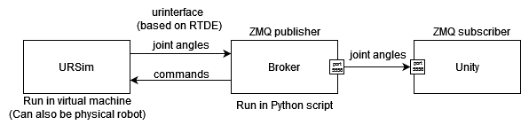
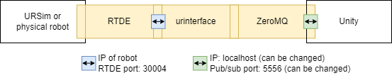

# Work-In-Progress: Setting up a Digital Shadow (DS) of a UR robot with Unity

This page describes how to setup a DS of a Universal Robot and visualize it through Unity.
URSim is the original simulator from Universal Robots.
We use URSim for simulating the physical robot. 
However, the connection to URSim and the physical robot are the same, and therefore the same code can be used on both the simulator and the physical robot.



This guide explains the different tools used to setup the DS. If more information is required, please contact the repository owners.
Furthermore, an example of a DS made using these programs is illustrated on [youtube](https://www.youtube.com/watch?v=1vt7-qrFvZc).

## urinterface

To connect to URSim we use the [_urinterface_](https://gitlab.au.dk/clagms/urinterface/-/tree/data_publisher?ref_type=heads) Python library.
We specifically use the _data_publisher_ branch, as it has a built-in ZeroMQ publisher, that publishes the joint angles to a local port 5556.

### Installation
This means to install the library, you need to:

1. clone the repository
```
git clone https://gitlab.au.dk/clagms/urinterface.git
```
2. switch to the _data_publisher_ branch
```
git switch data_publisher
```

### Details
_urinterface_ builds on top of the [Real-Time Data Exchange (RTDE)](https://www.universal-robots.com/articles/ur/interface-communication/real-time-data-exchange-rtde-guide/) protocol from [Universal Robots (UR)](https://www.universal-robots.com/).
The RTDE protocol is a server that runs on the UR robot when it is powered on, allowing clients to connect to it through the IP address of the robot and specific ports (specified in the RTDE description webpage).

The network connections are shown in the figure below. The middle blocks that are overlapping indicate that the messaging protocol uses the others, i.e., _urinterface_ uses the _RTDE_ library to communicate with the robot and uses _ZeroMQ_ to communicate with the DS application (in this case Unity).



For extracting data from the robot, the `record_configuration.xml` file is used, where different parameters can be registered. The location of the file can be specified in the code that connects to the robot.
A fragment of a `record_configuration.xml` file is shown below:
```xml
<?xml version="1.0"?>
<rtde_config>
	<recipe key="out">
		<field name="timestamp" type="DOUBLE"/>
		<field name="target_q" type="VECTOR6D"/>
		<field name="target_qd" type="VECTOR6D"/>
		<field name="target_qdd" type="VECTOR6D"/>
		<field name="target_current" type="VECTOR6D"/>
		<field name="target_moment" type="VECTOR6D"/>
		<field name="actual_q" type="VECTOR6D"/>
		<field name="actual_qd" type="VECTOR6D"/>
		<field name="actual_current" type="VECTOR6D"/>
		<field name="joint_control_output" type="VECTOR6D"/>
		<field name="actual_TCP_pose" type="VECTOR6D"/>
        ...
    </recipe>
</rtde_config>
```
As illustrated there are many parameters that can be extracted, and the main one we focus on in this guide is the `actual_q` parameter that measures the actual joint angles of the robot.
The type of the parameter is `VECTOR6D` which represents `6xDOUBLE`. In the case of `actual_q` it represents values from `0` to `5` indicating the joint numbers from the base (`0`) to the TCP (`5`).
To send parameters through the ZeroMQ socket, it is necessary that the chosen topic is also included in the `record_configuration.xml` file.
All of the parameters that can be extracted and their data types can be found in the [RTDE guide](https://www.universal-robots.com/articles/ur/interface-communication/real-time-data-exchange-rtde-guide/).


The joint angles are published through the topic _actual_q_0_ , _actual_q_1 , ... , _actual_q_5_ followed by the message, i.e., the actual joint value.
_actual_q_0_ is used for the base joint, _actual_q_1_ is used for the shoulder joint, etc.
To publish data to the socket, the following function must be called, with the desired topics to be published, as shown in this example:
```python
robot.start_recording(filename=filename, overwrite=True, frequency=50, config_file=config_file, publish_topic=["actual_q"])
```

### Using urinterface
To exemplify how `urinterface` can be used, we show a small extract of our code:
```python
from urinterface.robot_connection import RobotConnection 

...

# setup connection and create instance of robot connection
v0 = 1.0 # velocity
a0 = 5.0 # acceleration
vm_ip = "192.168.230.128" # IP address of robot (should be changed depending on your robot)
ur5e = RobotConnection(vm_ip) # Establish dashboard connection (port 29999) and controller connection (port 30002)

# setup config file and results file, and start recording data
f_name = "test_motion1.csv"
filename = Path("test_results") / Path(f_name)
config_file =  Path("resources") / Path("record_configuration.xml")
ur5e.start_recording(filename=filename, overwrite=True, frequency=50, config_file=config_file, publish_topic=["actual_q"]) # start recording and place the recorded data in test_motion.csv

#  send commands to control robot
while True:
    k = msvcrt.getwche() # get keyboard input to decide which commands to send
    if k == "c":
        break
    elif k in {"1","2"}:
        if k == "1":
            ur5e.movej(np.array([0.0, 0.0, 0.0, 0.0, 0.0, 0.0]), v=1.0, a=0.5)
        if k == "2":
            ur5e.load_program("/program1.urp") # this program must be available on the robot itself, i.e. you have to create a program on the robot called "program1" and save it
            ur5e.play_program()
    # reset k
    k = "a"

# stop recording data
ur5e.stop_recording()

```


## URSim
### Installation
#### For Non-Linux
Instructions for installing URSim on a non-Linux computer can be found in the _urinterface_ repository at [URSim install instructions](https://gitlab.au.dk/clagms/urinterface/-/blob/data_publisher/setup_with_ursim/setup_ursim.md?ref_type=heads).
If you are running a windows computer then you need a virtual machine, e.g., [VMware](https://www.vmware.com/nordics/products/workstation-player.html) or [VirtualBox](https://www.virtualbox.org/).

#### For Linux
For installing URSim on a Linux-based computer, follow these steps:
##### Install dependencies
```
$apt install lib32gcc1 lib32stdc++6 libc6-i386
$apt install libcurl4 fonts-ipafont fonts-baekmuk fonts-nanum fonts-arphic-uming fonts-arphic-ukai
$apt install openjdk-8-jdk libjava3d-java x11-apps mesa-utils lib32z1
```

##### Download URSim software "URSim_Linux-5.5.1.82186.tar.gz"
```cmd
$sudo service dbus start
$tar xzf URSim_Linux-5.5.1.82186.tar.gz
```
##### Install all dependencies given in the downloaded archive
```cmd
$cd ursim-5.5.1.82186/ursim-dependencies
$dpkg -i *.deb
$cd ursim-5.5.1.82186
```

##### Update install.sh with the following changes
```
71c73
< commonDependencies='libcurl3 libjava3d-* ttf-dejavu* fonts-ipafont fonts-baekmuk fonts-nanum fonts-arphic-uming fonts-arphic-ukai'
---
> commonDependencies='libcurl4 libjava3d-* ttf-dejavu* fonts-ipafont fonts-baekmuk fonts-nanum fonts-arphic-uming fonts-arphic-ukai'
81c83,84
< pkexec bash -c "apt-get -y install lib32gcc1 lib32stdc++6 libc6-i386 $commonDependencies && (echo '$packages' | xargs dpkg -i --force-overwrite)"
---
> pkexec bash -c "apt-get -y install lib32gcc1 lib32stdc++6 libc6-i386 $commonDependencies && (echo '$packages' | xargs dpkg -i --force-overwrite)" 88 bash -c "sudo apt-get -y install lib32gcc1 lib32stdc++6 libc6-i386 $commonDependencies && (echo '$packages' | xargs sudo dpkg -i --force-overwrite)"
````

##### Install and start URSim software
```cmd
$./install.sh
$./start-ursim.sh
```


### Using URSim

Instructions for using URSim, finding the IP address of the robot, and connecting to it can be found in [ursim_guide.pdf](resources/ursim_guide.pdf).

## ZeroMQ

We use the [pub/sub pattern](https://learning-0mq-with-pyzmq.readthedocs.io/en/latest/pyzmq/patterns/pubsub.html).
We use a Python script for running the ZeroMQ publisher, which sends the joint angle data on port 5556. This is currently built-in in the _urinterface_ branch _data_publisher_.

## Unity
We have set up an application with a UR5e robot in Unity, which has been built to be run on Windows and Linux. 
The visualization must connect to a local port, which is currently hardcoded in `urinterface` as 5556, and therefore when running the Unity application, the port number 5556 must be inputted.
 
 <!-- TODO: add gif showing the final setup of URSim and Unity visualization. -->

## Running the DS with URSim

### Instructions
1. Run URSim
2. Check the IP address of the robot and use that value for the variable `vm_ip` in the [ur_connector.py](application/PythonBroker/ur_connector.py) script.
3. Open a terminal in the same location as the [ur_connector.py](application/PythonBroker/ur_connector.py) script.
4. Run the program by typing the following in the terminal: ```python ur_connector.py```
5. Run the Unity application from the UnityBuild folder. 

For Linux follow:
```
$cd application/UnityBuild/Linux
$chmod +x ds_ur_linux.x86_64
$./ds_ur_linux.x86_64
```
For Windows open the `DigitalShadowsUR.exe` located in `applications/UnityBuild/Windows`.

Once the application is running enter the port number 5556 and press Enter.

6. Command the robot to move either through URSim directly, or through the [ur_connector.py](application/PythonBroker/ur_connector.py) script, by typinh either _1_ or _2_ in the terminal. 
7. To close the application, you must close Unity first, then the [ur_connector.py](application/PythonBroker/ur_connector.py) script, and URSim. To close the [ur_connector.py](application/PythonBroker/ur_connector.py) script, you can type _c_ in the terminal and the connection will terminate.


### Example

The following recording shows the DS running with URSim. As you can see in the recording, the Unity visualization is faster at visualizing the changes than URSim is, although the joint angles are being sent from URSim to Unity to visualize.


## Known issues
If the computer region has comma as the decimal separator, then the visualization of the joints may be incorrect, as Unity uses a dot as the decimal separator.
You can change the settings on your computer or if you have experience with Unity then you can change the C# script to use an [InvariantCulture](https://learn.microsoft.com/en-us/dotnet/api/system.globalization.cultureinfo.invariantculture?view=net-8.0). (This is already incorporated in the current Unity script)